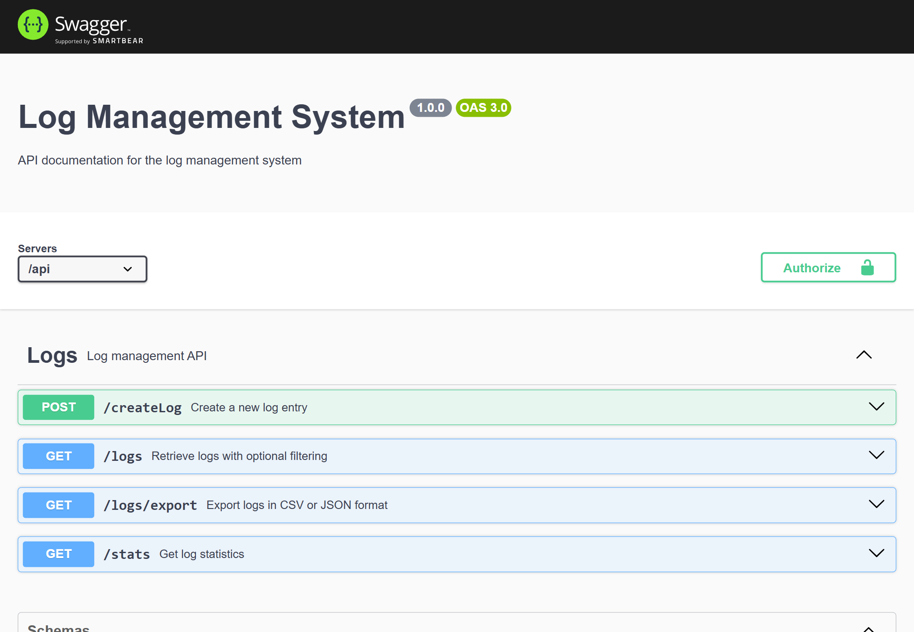
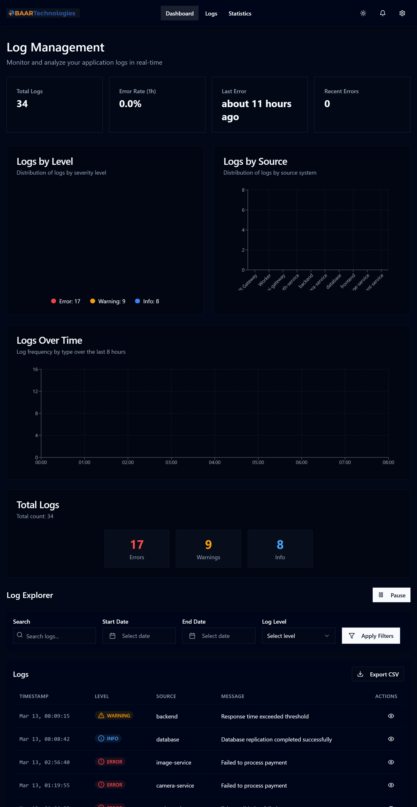

# Logtopia - Real-time Log Management System

## Overview
Logtopia is a modern web application designed to help developers and system administrators manage and monitor logs in real-time. It provides a user-friendly interface for viewing, analyzing, and managing system logs with real-time updates.


## Live Deployments
The application is also available online:

### Frontend
- Production URL: [https://logmanagementsystem.vercel.app/](https://logmanagementsystem.vercel.app/)

### Backend API Documentation
- Swagger UI: [https://baar-assignment-production.up.railway.app/api-docs/](https://baar-assignment-production.up.railway.app/api-docs/)

## Application Screenshots

### API Documentation


### Live Application


### System Architecture


## Features
- 🔄 Real-time log updates using http pooling
- 📊 Interactive log visualization
- 🔍 Advanced log filtering and search
- 🎨 Modern and responsive UI
- 📱 Mobile-friendly design
- 🌙 Dark/Light mode support

## Tech Stack

### Frontend
- React 18 with TypeScript
- Vite for fast development and building
- TailwindCSS for styling
- Shadcn UI components for beautiful interface
- React Query for data fetching
- Zustand for state management


### Backend
- Node.js with Express
- MongoDB for data storage
- Swagger for API documentation

## Getting Started

### Prerequisites
- Node.js (v14 or higher)
- MongoDB
- npm or yarn

### Installation

1. Clone the repository:
```bash
git clone [your-repository-url]
```

2. Install backend dependencies:
```bash
cd backend
npm install
```

3. Install frontend dependencies:
```bash
cd ../logtopia
npm install
```

4. Create a `.env` file in the backend directory with the following variables:
```
PORT=4000
MONGODB_URI=your_mongodb_connection_string
```

### Running the Application

1. Start the backend server:
```bash
cd backend
npm start
```

2. Start the frontend development server:
```bash
cd logtopia
npm run dev
```

The application will be available at:
- Frontend: http://localhost:5173
- Backend: http://localhost:4000
- API Documentation: http://localhost:4000/api-docs


## Project Structure

### Frontend (`/logtopia`)
- `/src` - Source code
  - `/components` - Reusable UI components
  - `/pages` - Page components
  - `/hooks` - Custom React hooks
  - `/lib` - Utility functions and configurations
  - `/store` - State management
  - `/types` - TypeScript type definitions

### Backend (`/backend`)
- `/routes` - API route definitions
- `/controllers` - Request handlers
- `/models` - Database models
- `/config` - Configuration files
- `/middleware` - Custom middleware
